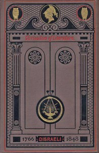

# Curiosities of Literature, Vol. 1 <kbd>21615</kbd>

## Authors

 - Disraeli, Isaac <small>(1766 - 1848)</small>

## Subjects

 - English literature -- History and criticism
 - Literature -- Anecdotes
 - Litterateurs

## Download

 - https://www.gutenberg.org/cache/epub/21615/pg21615.cover.medium.jpg
 - https://www.gutenberg.org/files/21615/21615.zip
 - https://www.gutenberg.org/files/21615/21615-8.zip
 - https://www.gutenberg.org/files/21615/21615-h/21615-h.htm
 - https://www.gutenberg.org/files/21615/21615.txt
 - https://www.gutenberg.org/ebooks/21615.html.images
 - https://www.gutenberg.org/ebooks/21615.txt.utf-8
 - https://www.gutenberg.org/ebooks/21615.epub.images
 - https://www.gutenberg.org/ebooks/21615.rdf
 - https://www.gutenberg.org/ebooks/21615.kindle.images

## Book Shelves

 - Bibliomania
