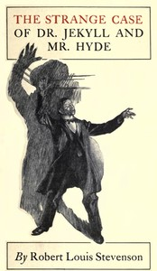

# The Strange Case of Dr. Jekyll and Mr. Hyde <kbd>43</kbd>

## Authors

 - Stevenson, Robert Louis <small>(1850 - 1894)</small>

## Subjects

 - Horror tales
 - London (England) -- Fiction
 - Multiple personality -- Fiction
 - Physicians -- Fiction
 - Psychological fiction
 - Science fiction
 - Self-experimentation in medicine -- Fiction

## Download

 - https://www.gutenberg.org/files/43/43-h.zip
 - https://www.gutenberg.org/files/43/43-0.zip
 - https://www.gutenberg.org/cache/epub/43/pg43.cover.medium.jpg
 - https://www.gutenberg.org/ebooks/43.html.images
 - https://www.gutenberg.org/ebooks/43.kindle.images
 - https://www.gutenberg.org/ebooks/43.rdf
 - https://www.gutenberg.org/ebooks/43.epub.images

## Book Shelves

 - Horror
 - Movie Books
 - Precursors of Science Fiction
