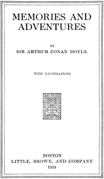

# Memories and Adventures <kbd>66991</kbd>

## Authors

 - Doyle, Arthur Conan <small>(1859 - 1930)</small>

## Subjects

 - Adventure and adventurers -- Great Britain -- Biography
 - Authors, Scottish -- 19th century -- Biography
 - Doyle, Arthur Conan, 1859-1930
 - Occultists -- Great Britain -- Biography

## Download

 - https://www.gutenberg.org/files/66991/66991-0.zip
 - https://www.gutenberg.org/files/66991/66991-h.zip
 - https://www.gutenberg.org/cache/epub/66991/pg66991.cover.small.jpg
 - https://www.gutenberg.org/ebooks/66991.rdf
 - https://www.gutenberg.org/ebooks/66991.epub.images
 - https://www.gutenberg.org/ebooks/66991.txt.utf-8
 - https://www.gutenberg.org/ebooks/66991.kindle.images
 - https://www.gutenberg.org/ebooks/66991.html.images
 - https://www.gutenberg.org/files/66991/66991-0.txt

## Book Shelves

