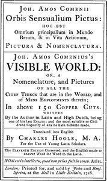

# The Orbis Pictus <kbd>28299</kbd>

## Authors

 - Comenius, Johann Amos <small>(1592 - 1670)</small>

## Subjects

 - Latin language -- Readers
 - Natural history -- Juvenile literature
 - Picture books for children

## Download

 - https://www.gutenberg.org/cache/epub/28299/pg28299.cover.small.jpg
 - https://www.gutenberg.org/files/28299/28299-h/28299-h.htm
 - https://www.gutenberg.org/files/28299/28299-0.txt
 - https://www.gutenberg.org/files/28299/28299-8.zip
 - https://www.gutenberg.org/ebooks/28299.html.images
 - https://www.gutenberg.org/files/28299/28299-8.txt
 - https://www.gutenberg.org/ebooks/28299.rdf
 - https://www.gutenberg.org/ebooks/28299.kindle.images
 - https://www.gutenberg.org/ebooks/28299.epub.images

## Book Shelves

