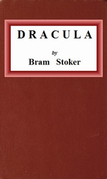

# Dracula <kbd>345</kbd>

## Authors

 - Stoker, Bram <small>(1847 - 1912)</small>

## Subjects

 - Dracula, Count (Fictitious character) -- Fiction
 - Epistolary fiction
 - Gothic fiction
 - Horror tales
 - Transylvania (Romania) -- Fiction
 - Vampires -- Fiction
 - Whitby (England) -- Fiction

## Download

 - https://www.gutenberg.org/cache/epub/345/pg345.cover.medium.jpg
 - https://www.gutenberg.org/files/345/345-0.zip
 - https://www.gutenberg.org/files/345/345-h/345-h.htm
 - https://www.gutenberg.org/ebooks/345.html.images
 - https://www.gutenberg.org/ebooks/345.kindle.images
 - https://www.gutenberg.org/ebooks/345.rdf
 - https://www.gutenberg.org/ebooks/345.epub.images

## Book Shelves

 - Gothic Fiction
 - Horror
 - Movie Books
 - Mystery Fiction
