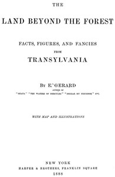

# The Land Beyond the Forest: Facts, Figures, and Fancies from Transylvania <kbd>57168</kbd>

## Authors

 - Gerard, E. (Emily) <small>(1849 - 1905)</small>

## Subjects

 - Transylvania (Romania) -- Description and travel

## Download

 - https://www.gutenberg.org/files/57168/57168-h/57168-h.htm
 - https://www.gutenberg.org/files/57168/57168-0.zip
 - https://www.gutenberg.org/cache/epub/57168/pg57168.cover.small.jpg
 - https://www.gutenberg.org/ebooks/57168.html.images
 - https://www.gutenberg.org/ebooks/57168.rdf
 - https://www.gutenberg.org/ebooks/57168.epub.images
 - https://www.gutenberg.org/ebooks/57168.kindle.images

## Book Shelves

