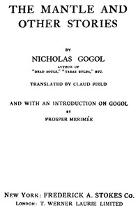

# The Mantle, and Other Stories <kbd>36238</kbd>

## Authors

 - Gogol, Nikolai Vasilevich <small>(1809 - 1852)</small>

## Subjects

 - Gogol, Nikolai Vasilevich, 1809-1852 -- Translations into English
 - Russia -- Social life and customs -- Fiction
 - Short stories, Russian -- Translations into English

## Download

 - https://www.gutenberg.org/files/36238/36238-h/36238-h.htm
 - https://www.gutenberg.org/files/36238/36238.zip
 - https://www.gutenberg.org/cache/epub/36238/pg36238.cover.small.jpg
 - https://www.gutenberg.org/files/36238/36238-8.zip
 - https://www.gutenberg.org/ebooks/36238.html.images
 - https://www.gutenberg.org/ebooks/36238.txt.utf-8
 - https://www.gutenberg.org/ebooks/36238.rdf
 - https://www.gutenberg.org/ebooks/36238.epub.images
 - https://www.gutenberg.org/ebooks/36238.kindle.images

## Book Shelves

