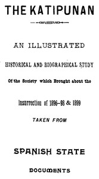

# The Katipunan; or, The Rise and Fall of the Filipino Commune <kbd>37587</kbd>

## Authors

 - St. Clair, Francis <small>(null - null)</small>

## Subjects

 - Katipunan (Philippines) -- History
 - Philippines -- History -- Revolution, 1896-1898
 - Revolutionaries -- Philippines -- Biography

## Download

 - https://www.gutenberg.org/files/37587/37587-8.zip
 - https://www.gutenberg.org/files/37587/37587.zip
 - https://www.gutenberg.org/files/37587/37587.txt
 - https://www.gutenberg.org/ebooks/37587.html.images
 - https://www.gutenberg.org/files/37587/37587-h/37587-h.htm
 - https://www.gutenberg.org/cache/epub/37587/pg37587.cover.small.jpg
 - https://www.gutenberg.org/ebooks/37587.rdf
 - https://www.gutenberg.org/ebooks/37587.epub.images
 - https://www.gutenberg.org/ebooks/37587.kindle.images
 - https://www.gutenberg.org/ebooks/37587.txt.utf-8

## Book Shelves

