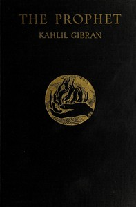

# The Prophet <kbd>58585</kbd>

## Authors

 - Gibran, Kahlil <small>(1883 - 1931)</small>

## Subjects

 - Mysticism -- Poetry
 - Prose poems, American

## Download

 - https://www.gutenberg.org/files/58585/58585-0.zip
 - https://www.gutenberg.org/cache/epub/58585/pg58585.cover.small.jpg
 - https://www.gutenberg.org/files/58585/58585-h.zip
 - https://www.gutenberg.org/ebooks/58585.txt.utf-8
 - https://www.gutenberg.org/files/58585/58585-0.txt
 - https://www.gutenberg.org/files/58585/58585-h/58585-h.htm
 - https://www.gutenberg.org/ebooks/58585.rdf
 - https://www.gutenberg.org/ebooks/58585.kindle.images
 - https://www.gutenberg.org/ebooks/58585.epub.images

## Book Shelves

