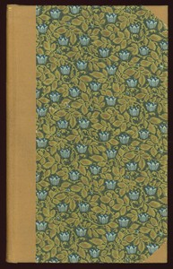

# One Hundred Merrie And Delightsome Stories: Right Pleasaunte To Relate In All Goodly Companie By Way Of Joyance And Jollity <kbd>18575</kbd>

## Authors

## Subjects

 - French fiction -- To 1500 -- Translations into English
 - Novelle
 - Tales, Medieval

## Download

 - https://www.gutenberg.org/files/18575/18575.zip
 - https://www.gutenberg.org/files/18575/18575-8.zip
 - https://www.gutenberg.org/files/18575/18575.txt
 - https://www.gutenberg.org/files/18575/18575-0.zip
 - https://www.gutenberg.org/cache/epub/18575/pg18575.cover.small.jpg
 - https://www.gutenberg.org/files/18575/18575-h/18575-h.htm
 - https://www.gutenberg.org/ebooks/18575.html.images
 - https://www.gutenberg.org/ebooks/18575.epub.images
 - https://www.gutenberg.org/ebooks/18575.kindle.images
 - https://www.gutenberg.org/ebooks/18575.rdf

## Book Shelves

