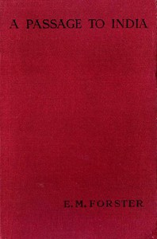

# A Passage to India <kbd>61221</kbd>

## Authors

 - Forster, E. M. (Edward Morgan) <small>(1879 - 1970)</small>

## Subjects

 - British -- India -- Fiction
 - India -- Social conditions -- 20th century -- Fiction
 - Political fiction
 - Race relations -- Fiction

## Download

 - https://www.gutenberg.org/files/61221/61221-h.zip
 - https://www.gutenberg.org/files/61221/61221-0.txt
 - https://www.gutenberg.org/cache/epub/61221/pg61221.cover.small.jpg
 - https://www.gutenberg.org/files/61221/61221-h/61221-h.htm
 - https://www.gutenberg.org/ebooks/61221.html.images
 - https://www.gutenberg.org/ebooks/61221.epub.images
 - https://www.gutenberg.org/ebooks/61221.rdf
 - https://www.gutenberg.org/ebooks/61221.kindle.images

## Book Shelves

