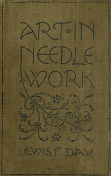

# Art in Needlework: A Book about Embroidery <kbd>28269</kbd>

## Authors

 - Day, Lewis F. (Lewis Foreman) <small>(1845 - 1910)</small>
 - Buckle, Mary <small>(null - null)</small>

## Subjects

 - Embroidery
 - Needlework

## Download

 - https://www.gutenberg.org/cache/epub/28269/pg28269.cover.medium.jpg
 - https://www.gutenberg.org/files/28269/28269-8.zip
 - https://www.gutenberg.org/files/28269/28269.txt
 - https://www.gutenberg.org/files/28269/28269-8.txt
 - https://www.gutenberg.org/files/28269/28269-h.zip
 - https://www.gutenberg.org/ebooks/28269.html.images
 - https://www.gutenberg.org/ebooks/28269.kindle.images
 - https://www.gutenberg.org/ebooks/28269.txt.utf-8
 - https://www.gutenberg.org/ebooks/28269.epub.images
 - https://www.gutenberg.org/ebooks/28269.rdf

## Book Shelves

 - Crafts
