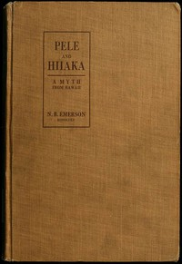

# Pele and Hiiaka: A Myth From Hawaii <kbd>60279</kbd>

## Authors

 - Emerson, Nathaniel Bright <small>(1839 - 1915)</small>

## Subjects

 - Legends -- Hawaii

## Download

 - https://www.gutenberg.org/cache/epub/60279/pg60279.cover.small.jpg
 - https://www.gutenberg.org/files/60279/60279-8.txt
 - https://www.gutenberg.org/files/60279/60279-h.zip
 - https://www.gutenberg.org/files/60279/60279-h/60279-h.htm
 - https://www.gutenberg.org/ebooks/60279.html.images
 - https://www.gutenberg.org/files/60279/60279.txt
 - https://www.gutenberg.org/ebooks/60279.epub.images
 - https://www.gutenberg.org/ebooks/60279.txt.utf-8
 - https://www.gutenberg.org/ebooks/60279.rdf
 - https://www.gutenberg.org/ebooks/60279.kindle.images

## Book Shelves

