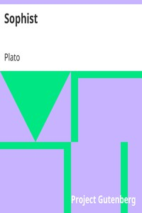

# Sophist <kbd>1735</kbd>

## Authors

 - Plato <small>(-428 - -348)</small>

## Subjects

 - Classical literature
 - Logic, Ancient
 - Meaning (Philosophy)
 - Methodology
 - Ontology
 - Sophists (Greek philosophy)

## Download

 - https://www.gutenberg.org/files/1735/1735.zip
 - https://www.gutenberg.org/files/1735/1735-h.zip
 - https://www.gutenberg.org/cache/epub/1735/pg1735.cover.small.jpg
 - https://www.gutenberg.org/ebooks/1735.html.images
 - https://www.gutenberg.org/ebooks/1735.rdf
 - https://www.gutenberg.org/ebooks/1735.epub.images
 - https://www.gutenberg.org/ebooks/1735.kindle.images
 - https://www.gutenberg.org/ebooks/1735.txt.utf-8

## Book Shelves

