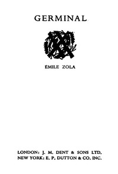

# Germinal <kbd>56528</kbd>

## Authors

 - Zola, Émile <small>(1840 - 1902)</small>

## Subjects

 - Coal miners -- Fiction
 - Coal mines and mining -- Fiction
 - France, Northern -- Fiction
 - Labor disputes -- Fiction
 - Political fiction
 - Strikes and lockouts -- Fiction

## Download

 - https://www.gutenberg.org/files/56528/56528-0.zip
 - https://www.gutenberg.org/cache/epub/56528/pg56528.cover.small.jpg
 - https://www.gutenberg.org/files/56528/56528-h/56528-h.htm
 - https://www.gutenberg.org/files/56528/56528-0.txt
 - https://www.gutenberg.org/ebooks/56528.txt.utf-8
 - https://www.gutenberg.org/ebooks/56528.rdf
 - https://www.gutenberg.org/ebooks/56528.epub.images
 - https://www.gutenberg.org/ebooks/56528.kindle.images

## Book Shelves

