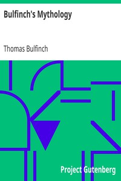

# Bulfinch's Mythology <kbd>4928</kbd>

## Authors

 - Bulfinch, Thomas <small>(1796 - 1867)</small>

## Subjects

 - Charlemagne, Emperor, 742-814 -- Romances -- Adaptations
 - Folklore -- Europe
 - Mythology
 - Romances

## Download

 - https://www.gutenberg.org/cache/epub/4928/pg4928.cover.small.jpg
 - https://www.gutenberg.org/files/4928/4928.zip
 - https://www.gutenberg.org/files/4928/4928.txt
 - https://www.gutenberg.org/ebooks/4928.html.images
 - https://www.gutenberg.org/ebooks/4928.kindle.images
 - https://www.gutenberg.org/ebooks/4928.epub.images
 - https://www.gutenberg.org/ebooks/4928.txt.utf-8
 - https://www.gutenberg.org/ebooks/4928.rdf

## Book Shelves

