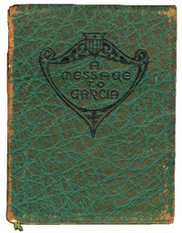

# A Message to Garcia: Being a Preachment <kbd>17195</kbd>

## Authors

 - Hubbard, Elbert <small>(1856 - 1915)</small>

## Subjects

 - Rowan, Andrew Summers
 - Spanish-American War, 1898
 - Success

## Download

 - https://www.gutenberg.org/files/17195/17195.zip
 - https://www.gutenberg.org/cache/epub/17195/pg17195.cover.small.jpg
 - https://www.gutenberg.org/files/17195/17195-h/17195-h.htm
 - https://www.gutenberg.org/ebooks/17195.html.images
 - https://www.gutenberg.org/ebooks/17195.txt.utf-8
 - https://www.gutenberg.org/ebooks/17195.kindle.images
 - https://www.gutenberg.org/ebooks/17195.epub.images
 - https://www.gutenberg.org/ebooks/17195.rdf

## Book Shelves

