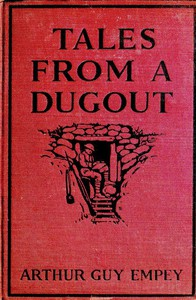

# Tales from a Dugout <kbd>67697</kbd>

## Authors

 - Empey, Arthur Guy <small>(1883 - 1963)</small>

## Subjects

 - Short stories, American
 - War stories, American
 - World War, 1914-1918 -- Fiction

## Download

 - https://www.gutenberg.org/ebooks/67697.txt.utf-8
 - https://www.gutenberg.org/ebooks/67697.rdf
 - https://www.gutenberg.org/ebooks/67697.epub.images
 - https://www.gutenberg.org/cache/epub/67697/pg67697.cover.small.jpg
 - https://www.gutenberg.org/ebooks/67697.html.images
 - https://www.gutenberg.org/ebooks/67697.kindle.images
 - https://www.gutenberg.org/files/67697/67697-0.txt
 - https://www.gutenberg.org/files/67697/67697-h.zip
 - https://www.gutenberg.org/files/67697/67697-0.zip

## Book Shelves

