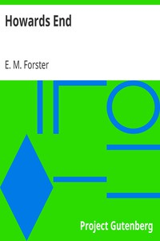

# Howards End <kbd>2891</kbd>

## Authors

 - Forster, E. M. (Edward Morgan) <small>(1879 - 1970)</small>

## Subjects

 - Country homes -- Fiction
 - Domestic fiction
 - England -- Fiction
 - Illegitimate children -- Fiction
 - Inheritance and succession -- Fiction
 - Remarried people -- Fiction
 - Sisters -- Fiction
 - Social classes -- Fiction

## Download

 - https://www.gutenberg.org/files/2891/2891.txt
 - https://www.gutenberg.org/files/2891/2891-h/2891-h.htm
 - https://www.gutenberg.org/cache/epub/2891/pg2891.cover.small.jpg
 - https://www.gutenberg.org/ebooks/2891.kindle.images
 - https://www.gutenberg.org/ebooks/2891.txt.utf-8
 - https://www.gutenberg.org/ebooks/2891.rdf
 - https://www.gutenberg.org/ebooks/2891.epub.images

## Book Shelves

