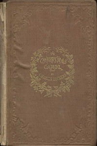

# A Christmas Carol in Prose; Being a Ghost Story of Christmas <kbd>46</kbd>

## Authors

 - Dickens, Charles <small>(1812 - 1870)</small>

## Subjects

 - Christmas stories
 - Ghost stories
 - London (England) -- Fiction
 - Misers -- Fiction
 - Poor families -- Fiction
 - Scrooge, Ebenezer (Fictitious character) -- Fiction
 - Sick children -- Fiction

## Download

 - https://www.gutenberg.org/files/46/46-0.zip
 - https://www.gutenberg.org/files/46/46-h/46-h.htm
 - https://www.gutenberg.org/cache/epub/46/pg46.cover.small.jpg
 - https://www.gutenberg.org/ebooks/46.txt.utf-8
 - https://www.gutenberg.org/files/46/46-0.txt
 - https://www.gutenberg.org/ebooks/46.kindle.images
 - https://www.gutenberg.org/ebooks/46.rdf
 - https://www.gutenberg.org/ebooks/46.epub.images

## Book Shelves

 - Children's Literature
 - Christmas
