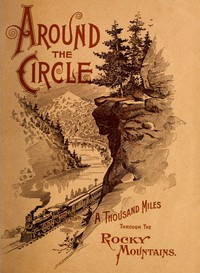

# "Around the Circle": One Thousand Miles Through the Rocky Mountains <kbd>67539</kbd>

## Authors

 - Denver and Rio Grande Railroad Company <small>(null - null)</small>

## Subjects

 - Colorado -- Guidebooks
 - Railroad travel -- Colorado
 - Rocky Mountains -- Guidebooks

## Download

 - https://www.gutenberg.org/ebooks/67539.rdf
 - https://www.gutenberg.org/ebooks/67539.txt.utf-8
 - https://www.gutenberg.org/ebooks/67539.epub.images
 - https://www.gutenberg.org/ebooks/67539.kindle.images
 - https://www.gutenberg.org/cache/epub/67539/pg67539.cover.small.jpg
 - https://www.gutenberg.org/ebooks/67539.html.images
 - https://www.gutenberg.org/files/67539/67539-0.zip
 - https://www.gutenberg.org/files/67539/67539-h.zip
 - https://www.gutenberg.org/files/67539/67539-0.txt

## Book Shelves

