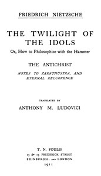

# The Twilight of the Idols; or, How to Philosophize with the Hammer. The Antichrist: Complete Works, Volume Sixteen <kbd>52263</kbd>

## Authors

 - Nietzsche, Friedrich Wilhelm <small>(1844 - 1900)</small>

## Subjects

 - Philosophy

## Download

 - https://www.gutenberg.org/files/52263/52263-0.txt
 - https://www.gutenberg.org/files/52263/52263-h.zip
 - https://www.gutenberg.org/files/52263/52263-h/52263-h.htm
 - https://www.gutenberg.org/cache/epub/52263/pg52263.cover.small.jpg
 - https://www.gutenberg.org/ebooks/52263.html.images
 - https://www.gutenberg.org/ebooks/52263.kindle.images
 - https://www.gutenberg.org/ebooks/52263.rdf
 - https://www.gutenberg.org/ebooks/52263.epub.images

## Book Shelves

