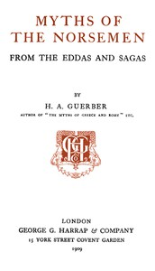

# Myths of the Norsemen: From the Eddas and Sagas <kbd>28497</kbd>

## Authors

 - Guerber, H. A. (Hélène Adeline) <small>(1859 - 1929)</small>

## Subjects

 - Mythology, Norse

## Download

 - https://www.gutenberg.org/files/28497/28497-8.zip
 - https://www.gutenberg.org/files/28497/28497-h/28497-h.htm
 - https://www.gutenberg.org/files/28497/28497.txt
 - https://www.gutenberg.org/cache/epub/28497/pg28497.cover.medium.jpg
 - https://www.gutenberg.org/ebooks/28497.html.images
 - https://www.gutenberg.org/ebooks/28497.rdf
 - https://www.gutenberg.org/ebooks/28497.kindle.images
 - https://www.gutenberg.org/ebooks/28497.epub.images
 - https://www.gutenberg.org/ebooks/28497.txt.utf-8

## Book Shelves

 - Paganism
