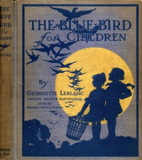

# The Blue Bird for Children: The Wonderful Adventures of Tyltyl and Mytyl in Search of Happiness <kbd>27991</kbd>

## Authors

 - Maeterlinck, Maurice <small>(1862 - 1949)</small>
 - Leblanc, Georgette <small>(1869 - 1941)</small>

## Subjects

 - Children -- Juvenile fiction
 - Children's stories

## Download

 - https://www.gutenberg.org/files/27991/27991-h.zip
 - https://www.gutenberg.org/files/27991/27991.zip
 - https://www.gutenberg.org/files/27991/27991-8.zip
 - https://www.gutenberg.org/files/27991/27991.txt
 - https://www.gutenberg.org/cache/epub/27991/pg27991.cover.medium.jpg
 - https://www.gutenberg.org/ebooks/27991.html.images
 - https://www.gutenberg.org/ebooks/27991.txt.utf-8
 - https://www.gutenberg.org/ebooks/27991.epub.images
 - https://www.gutenberg.org/ebooks/27991.rdf
 - https://www.gutenberg.org/ebooks/27991.kindle.images

## Book Shelves

