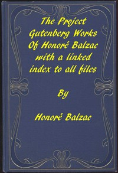

# The Works of Balzac: A linked index to all Project Gutenberg editions <kbd>31565</kbd>

## Authors

 - Balzac, Honoré de <small>(1799 - 1850)</small>

## Subjects

 - French fiction -- Translations into English

## Download

 - https://www.gutenberg.org/cache/epub/31565/pg31565.cover.small.jpg
 - https://www.gutenberg.org/files/31565/31565.txt
 - https://www.gutenberg.org/files/31565/31565-8.zip
 - https://www.gutenberg.org/files/31565/31565-h/31565-h.htm
 - https://www.gutenberg.org/files/31565/31565.zip
 - https://www.gutenberg.org/ebooks/31565.html.images
 - https://www.gutenberg.org/ebooks/31565.txt.utf-8
 - https://www.gutenberg.org/ebooks/31565.epub.images
 - https://www.gutenberg.org/ebooks/31565.rdf
 - https://www.gutenberg.org/ebooks/31565.kindle.images

## Book Shelves

