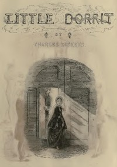

# Little Dorrit <kbd>963</kbd>

## Authors

 - Dickens, Charles <small>(1812 - 1870)</small>

## Subjects

 - Children of prisoners -- Fiction
 - Debt, Imprisonment for -- Fiction
 - Domestic fiction
 - Fathers and daughters -- Fiction
 - Inheritance and succession -- Fiction
 - London (England) -- Fiction
 - Love stories
 - Marshalsea Prison (Southwark, London, England) -- Fiction

## Download

 - https://www.gutenberg.org/files/963/963-0.zip
 - https://www.gutenberg.org/files/963/963.txt
 - https://www.gutenberg.org/files/963/963-h.zip
 - https://www.gutenberg.org/files/963/963-0.txt
 - https://www.gutenberg.org/cache/epub/963/pg963.cover.medium.jpg
 - https://www.gutenberg.org/ebooks/963.html.images
 - https://www.gutenberg.org/ebooks/963.kindle.images
 - https://www.gutenberg.org/ebooks/963.rdf
 - https://www.gutenberg.org/ebooks/963.epub.images

## Book Shelves

