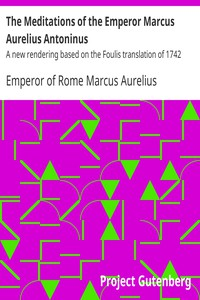

# The Meditations of the Emperor Marcus Aurelius Antoninus: A new rendering based on the Foulis translation of 1742 <kbd>55317</kbd>

## Authors

 - Marcus Aurelius, Emperor of Rome <small>(121 - 180)</small>

## Subjects

 - Ethics
 - Life
 - Stoics

## Download

 - https://www.gutenberg.org/cache/epub/55317/pg55317.cover.small.jpg
 - https://www.gutenberg.org/files/55317/55317-h/55317-h.htm
 - https://www.gutenberg.org/files/55317/55317-0.txt
 - https://www.gutenberg.org/ebooks/55317.html.images
 - https://www.gutenberg.org/ebooks/55317.rdf
 - https://www.gutenberg.org/ebooks/55317.kindle.images
 - https://www.gutenberg.org/ebooks/55317.epub.images

## Book Shelves

