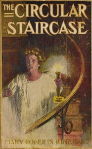

# The Circular Staircase <kbd>434</kbd>

## Authors

 - Rinehart, Mary Roberts <small>(1876 - 1958)</small>

## Subjects

 - Country homes -- Fiction
 - Middle-aged women -- Fiction
 - Murder -- Investigation -- Fiction
 - Mystery fiction

## Download

 - https://www.gutenberg.org/cache/epub/434/pg434.cover.small.jpg
 - https://www.gutenberg.org/files/434/434-h.zip
 - https://www.gutenberg.org/ebooks/434.html.images
 - https://www.gutenberg.org/files/434/434-h/434-h.htm
 - https://www.gutenberg.org/files/434/434-0.txt
 - https://www.gutenberg.org/ebooks/434.kindle.images
 - https://www.gutenberg.org/ebooks/434.rdf
 - https://www.gutenberg.org/ebooks/434.epub.images

## Book Shelves

 - Detective Fiction
