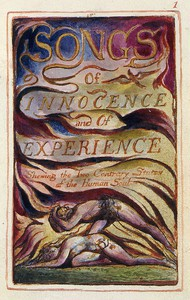

# Songs of Innocence and of Experience <kbd>1934</kbd>

## Authors

 - Blake, William <small>(1757 - 1827)</small>

## Subjects

 - English poetry -- 18th century
 - Pastoral poetry

## Download

 - https://www.gutenberg.org/cache/epub/1934/pg1934.cover.small.jpg
 - https://www.gutenberg.org/ebooks/1934.html.images
 - https://www.gutenberg.org/files/1934/1934-0.zip
 - https://www.gutenberg.org/ebooks/1934.txt.utf-8
 - https://www.gutenberg.org/files/1934/1934-0.txt
 - https://www.gutenberg.org/ebooks/1934.rdf
 - https://www.gutenberg.org/ebooks/1934.epub.images
 - https://www.gutenberg.org/ebooks/1934.kindle.images

## Book Shelves

