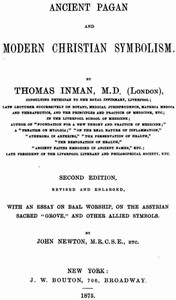

# Ancient Pagan and Modern Christian Symbolism: With an Essay on Baal Worship, on the Assyrian Sacred "Grove," and Other Allied Symbols <kbd>38485</kbd>

## Authors

 - Inman, Thomas <small>(1820 - 1876)</small>
 - Newton, John, M.R.C.S.E. <small>(null - null)</small>

## Subjects

 - Christian art and symbolism
 - Symbolism

## Download

 - https://www.gutenberg.org/files/38485/38485.zip
 - https://www.gutenberg.org/cache/epub/38485/pg38485.cover.small.jpg
 - https://www.gutenberg.org/files/38485/38485-8.txt
 - https://www.gutenberg.org/files/38485/38485-h/38485-h.htm
 - https://www.gutenberg.org/ebooks/38485.html.images
 - https://www.gutenberg.org/ebooks/38485.txt.utf-8
 - https://www.gutenberg.org/ebooks/38485.rdf
 - https://www.gutenberg.org/ebooks/38485.kindle.images
 - https://www.gutenberg.org/ebooks/38485.epub.images

## Book Shelves

