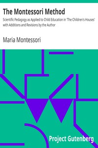

# The Montessori Method: Scientific Pedagogy as Applied to Child Education in 'The Children's Houses' with Additions and Revisions by the Author <kbd>39863</kbd>

## Authors

 - Montessori, Maria <small>(1870 - 1952)</small>

## Subjects

 - Montessori method of education

## Download

 - https://www.gutenberg.org/cache/epub/39863/pg39863.cover.small.jpg
 - https://www.gutenberg.org/files/39863/39863.txt
 - https://www.gutenberg.org/files/39863/39863-h.zip
 - https://www.gutenberg.org/files/39863/39863-h/39863-h.htm
 - https://www.gutenberg.org/ebooks/39863.html.images
 - https://www.gutenberg.org/files/39863/39863-8.txt
 - https://www.gutenberg.org/ebooks/39863.txt.utf-8
 - https://www.gutenberg.org/ebooks/39863.rdf
 - https://www.gutenberg.org/ebooks/39863.kindle.images
 - https://www.gutenberg.org/ebooks/39863.epub.images

## Book Shelves

 - Bestsellers, American, 1895-1923
