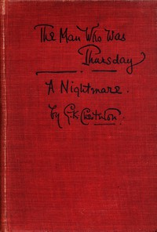

# The Man Who Was Thursday: A Nightmare <kbd>1695</kbd>

## Authors

 - Chesterton, G. K. (Gilbert Keith) <small>(1874 - 1936)</small>

## Subjects

 - Allegories
 - Anarchists -- Fiction
 - Detective and mystery stories
 - Fantasy fiction
 - London (England) -- Fiction
 - Police -- Fiction

## Download

 - https://www.gutenberg.org/ebooks/1695.html.images
 - https://www.gutenberg.org/cache/epub/1695/pg1695.cover.small.jpg
 - https://www.gutenberg.org/files/1695/1695-0.zip
 - https://www.gutenberg.org/files/1695/1695-h.zip
 - https://www.gutenberg.org/ebooks/1695.txt.utf-8
 - https://www.gutenberg.org/files/1695/1695-0.txt
 - https://www.gutenberg.org/ebooks/1695.rdf
 - https://www.gutenberg.org/ebooks/1695.epub.images
 - https://www.gutenberg.org/ebooks/1695.kindle.images

## Book Shelves

 - Best Books Ever Listings
