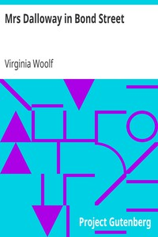

# Mrs Dalloway in Bond Street <kbd>63107</kbd>

## Authors

 - Woolf, Virginia <small>(1882 - 1941)</small>

## Subjects

 - English fiction -- 20th century
 - London (England) -- Fiction
 - Married women -- Fiction
 - Short stories, English

## Download

 - https://www.gutenberg.org/files/63107/63107-h.zip
 - https://www.gutenberg.org/files/63107/63107.zip
 - https://www.gutenberg.org/cache/epub/63107/pg63107.cover.medium.jpg
 - https://www.gutenberg.org/files/63107/63107-h/63107-h.htm
 - https://www.gutenberg.org/ebooks/63107.html.images
 - https://www.gutenberg.org/ebooks/63107.epub.images
 - https://www.gutenberg.org/ebooks/63107.rdf
 - https://www.gutenberg.org/ebooks/63107.txt.utf-8
 - https://www.gutenberg.org/ebooks/63107.kindle.images

## Book Shelves

