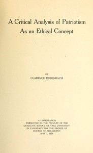

# A Critical Analysis of Patriotism As an Ethical Concept: A Dissertation Presented to the Faculty of the Graduate School of Yale University in Candidacy for the Degree of Doctor of Philosophy May 1, 1918 <kbd>67599</kbd>

## Authors

 - Reidenbach, Clarence <small>(null - null)</small>

## Subjects

 - Patriotism
 - Thesis (Ph. D.)

## Download

 - https://www.gutenberg.org/ebooks/67599.txt.utf-8
 - https://www.gutenberg.org/cache/epub/67599/pg67599.cover.medium.jpg
 - https://www.gutenberg.org/ebooks/67599.epub.images
 - https://www.gutenberg.org/files/67599/67599-h.zip
 - https://www.gutenberg.org/ebooks/67599.kindle.images
 - https://www.gutenberg.org/ebooks/67599.html.images
 - https://www.gutenberg.org/ebooks/67599.rdf
 - https://www.gutenberg.org/files/67599/67599-0.txt

## Book Shelves

