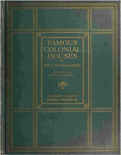

# Famous Colonial Houses <kbd>67591</kbd>

## Authors

 - Hollister, Paul M. (Paul Merrick) <small>(1890 - 1970)</small>

## Subjects

 - Architecture, Colonial
 - Architecture, Domestic -- United States
 - Dwellings -- United States
 - Historic buildings -- United States

## Download

 - https://www.gutenberg.org/ebooks/67591.txt.utf-8
 - https://www.gutenberg.org/ebooks/67591.kindle.images
 - https://www.gutenberg.org/ebooks/67591.rdf
 - https://www.gutenberg.org/cache/epub/67591/pg67591.cover.small.jpg
 - https://www.gutenberg.org/ebooks/67591.epub.images
 - https://www.gutenberg.org/files/67591/67591-h.zip
 - https://www.gutenberg.org/files/67591/67591-0.zip
 - https://www.gutenberg.org/files/67591/67591-0.txt
 - https://www.gutenberg.org/files/67591/67591-h/67591-h.htm

## Book Shelves

