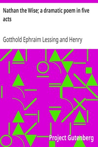

# Nathan the Wise; a dramatic poem in five acts <kbd>3820</kbd>

## Authors

 - Lessing, Gotthold Ephraim <small>(1729 - 1781)</small>

## Subjects

 - German drama -- Translations into English

## Download

 - https://www.gutenberg.org/files/3820/3820-0.zip
 - https://www.gutenberg.org/files/3820/3820-0.txt
 - https://www.gutenberg.org/ebooks/3820.html.images
 - https://www.gutenberg.org/cache/epub/3820/pg3820.cover.medium.jpg
 - https://www.gutenberg.org/ebooks/3820.kindle.images
 - https://www.gutenberg.org/ebooks/3820.epub.images
 - https://www.gutenberg.org/ebooks/3820.rdf

## Book Shelves

