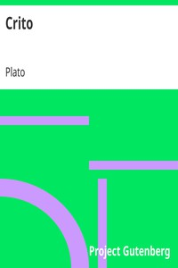

# Crito <kbd>1657</kbd>

## Authors

 - Plato <small>(-428 - -348)</small>

## Subjects

 - Classical literature
 - Dialogues, Greek -- Translations into English
 - Justice -- Early works to 1800
 - Philosophy, Ancient

## Download

 - https://www.gutenberg.org/files/1657/1657.zip
 - https://www.gutenberg.org/files/1657/1657-h/1657-h.htm
 - https://www.gutenberg.org/cache/epub/1657/pg1657.cover.medium.jpg
 - https://www.gutenberg.org/ebooks/1657.html.images
 - https://www.gutenberg.org/ebooks/1657.kindle.images
 - https://www.gutenberg.org/ebooks/1657.txt.utf-8
 - https://www.gutenberg.org/ebooks/1657.rdf
 - https://www.gutenberg.org/ebooks/1657.epub.images

## Book Shelves

 - Harvard Classics
