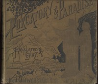

# The Divine Comedy by Dante, Illustrated, Purgatory, Complete <kbd>8795</kbd>

## Authors

 - Dante Alighieri <small>(1265 - 1321)</small>

## Subjects

 - Epic poetry, Italian -- Translations into English
 - Italian poetry -- To 1400 -- Translations into English

## Download

 - https://www.gutenberg.org/files/8795/8795-h.zip
 - https://www.gutenberg.org/cache/epub/8795/pg8795.cover.medium.jpg
 - https://www.gutenberg.org/files/8795/8795.txt
 - https://www.gutenberg.org/files/8795/8795-h/8795-h.htm
 - https://www.gutenberg.org/ebooks/8795.html.images
 - https://www.gutenberg.org/ebooks/8795.kindle.images
 - https://www.gutenberg.org/ebooks/8795.rdf
 - https://www.gutenberg.org/ebooks/8795.txt.utf-8
 - https://www.gutenberg.org/ebooks/8795.epub.images

## Book Shelves

 - Italy
