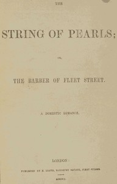

# The String of Pearls; Or, The Barber of Fleet Street. A Domestic Romance. <kbd>59828</kbd>

## Authors

 - Rymer, James Malcolm <small>(null - 1884)</small>
 - Prest, Thomas Peckett <small>(1810 - 1859)</small>

## Subjects

 - Bakers -- Fiction
 - Barbers -- Fiction
 - Cannibalism -- Fiction
 - Fleet Street (London, England) -- Fiction
 - Historical fiction
 - Horror tales
 - London (England) -- Social life and customs -- 18th century -- Fiction
 - Missing persons -- Fiction
 - Murder -- Fiction
 - Mystery fiction
 - Revenge -- Fiction
 - Suspense fiction
 - Todd, Sweeney (Legendary character) -- Fiction
 - Young women -- Fiction

## Download

 - https://www.gutenberg.org/files/59828/59828-8.zip
 - https://www.gutenberg.org/cache/epub/59828/pg59828.cover.medium.jpg
 - https://www.gutenberg.org/files/59828/59828-8.txt
 - https://www.gutenberg.org/files/59828/59828-h/59828-h.htm
 - https://www.gutenberg.org/files/59828/59828.txt
 - https://www.gutenberg.org/ebooks/59828.kindle.images
 - https://www.gutenberg.org/ebooks/59828.txt.utf-8
 - https://www.gutenberg.org/ebooks/59828.rdf
 - https://www.gutenberg.org/ebooks/59828.epub.images

## Book Shelves

