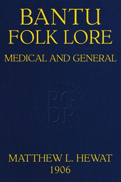

# Bantu Folk Lore (Medical and General) <kbd>67597</kbd>

## Authors

 - Hewat, Matthew L. <small>(null - null)</small>

## Subjects

 - Pondo (African people)
 - Traditional medicine -- South Africa
 - Xhosa (African people)
 - Zulu (African people)

## Download

 - https://www.gutenberg.org/cache/epub/67597/pg67597.cover.medium.jpg
 - https://www.gutenberg.org/files/67597/67597-h/67597-h.htm
 - https://www.gutenberg.org/ebooks/67597.txt.utf-8
 - https://www.gutenberg.org/files/67597/67597-h.zip
 - https://www.gutenberg.org/ebooks/67597.kindle.images
 - https://www.gutenberg.org/files/67597/67597-0.zip
 - https://www.gutenberg.org/ebooks/67597.epub.images
 - https://www.gutenberg.org/ebooks/67597.rdf
 - https://www.gutenberg.org/files/67597/67597-0.txt

## Book Shelves

