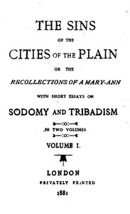

# The Sins of the Cities of the Plain; or, The Recollections of a Mary-Ann: with Short Essays on Sodomy and Tribadism <kbd>53964</kbd>

## Authors

 - Saul, Jack <small>(1857 - 1904)</small>

## Subjects

 - Gay men -- England -- Fiction

## Download

 - https://www.gutenberg.org/files/53964/53964-8.txt
 - https://www.gutenberg.org/files/53964/53964-h/53964-h.htm
 - https://www.gutenberg.org/cache/epub/53964/pg53964.cover.small.jpg
 - https://www.gutenberg.org/files/53964/53964-h.zip
 - https://www.gutenberg.org/ebooks/53964.html.images
 - https://www.gutenberg.org/ebooks/53964.rdf
 - https://www.gutenberg.org/ebooks/53964.kindle.images
 - https://www.gutenberg.org/ebooks/53964.epub.images
 - https://www.gutenberg.org/ebooks/53964.txt.utf-8

## Book Shelves

