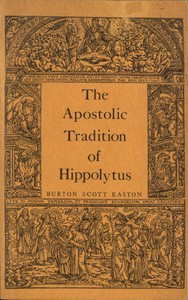

# The Apostolic Tradition of Hippolytus: Translated into English with Introduction and Notes <kbd>61614</kbd>

## Authors

 - Hippolytus, Antipope <small>(null - 235)</small>

## Subjects

 - Canon law -- Early church, ca. 30-600
 - Church orders, Ancient

## Download

 - https://www.gutenberg.org/cache/epub/61614/pg61614.cover.medium.jpg
 - https://www.gutenberg.org/files/61614/61614-h.zip
 - https://www.gutenberg.org/files/61614/61614-0.txt
 - https://www.gutenberg.org/ebooks/61614.html.images
 - https://www.gutenberg.org/ebooks/61614.epub.images
 - https://www.gutenberg.org/ebooks/61614.rdf
 - https://www.gutenberg.org/ebooks/61614.kindle.images

## Book Shelves

