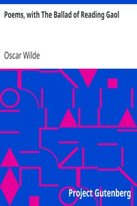

# Poems, with The Ballad of Reading Gaol <kbd>1057</kbd>

## Authors

 - Wilde, Oscar <small>(1854 - 1900)</small>

## Subjects

 - Poetry
 - Prisons -- Poetry

## Download

 - https://www.gutenberg.org/cache/epub/1057/pg1057.cover.small.jpg
 - https://www.gutenberg.org/files/1057/1057-0.zip
 - https://www.gutenberg.org/files/1057/1057-h/1057-h.htm
 - https://www.gutenberg.org/files/1057/1057-h.zip
 - https://www.gutenberg.org/ebooks/1057.rdf
 - https://www.gutenberg.org/ebooks/1057.epub.images
 - https://www.gutenberg.org/ebooks/1057.kindle.images

## Book Shelves

