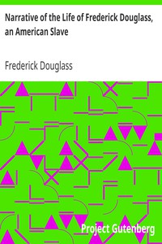

# Narrative of the Life of Frederick Douglass, an American Slave <kbd>23</kbd>

## Authors

 - Douglass, Frederick <small>(1818 - 1895)</small>

## Subjects

 - Abolitionists -- United States -- Biography
 - African American abolitionists -- Biography
 - Douglass, Frederick, 1818-1895
 - Slaves -- United States -- Biography

## Download

 - https://www.gutenberg.org/cache/epub/23/pg23.cover.small.jpg
 - https://www.gutenberg.org/files/23/23-h.zip
 - https://www.gutenberg.org/files/23/23-0.zip
 - https://www.gutenberg.org/ebooks/23.html.images
 - https://www.gutenberg.org/files/23/23-0.txt
 - https://www.gutenberg.org/ebooks/23.kindle.images
 - https://www.gutenberg.org/ebooks/23.rdf
 - https://www.gutenberg.org/ebooks/23.epub.images

## Book Shelves

 - African American Writers
 - Slavery
