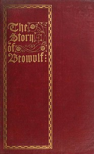

# The Story of Beowulf, Translated from Anglo-Saxon into Modern English Prose <kbd>50742</kbd>

## Authors

## Subjects

 - Beowulf -- Adaptations
 - Epic poetry, English (Old) -- Adaptations
 - Heroes -- Fiction
 - Monsters -- Fiction

## Download

 - https://www.gutenberg.org/files/50742/50742-h.zip
 - https://www.gutenberg.org/cache/epub/50742/pg50742.cover.medium.jpg
 - https://www.gutenberg.org/files/50742/50742-8.zip
 - https://www.gutenberg.org/ebooks/50742.html.images
 - https://www.gutenberg.org/ebooks/50742.txt.utf-8
 - https://www.gutenberg.org/ebooks/50742.kindle.images
 - https://www.gutenberg.org/ebooks/50742.epub.images
 - https://www.gutenberg.org/ebooks/50742.rdf

## Book Shelves

