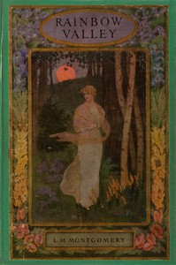

# Rainbow Valley <kbd>5343</kbd>

## Authors

 - Montgomery, L. M. (Lucy Maud) <small>(1874 - 1942)</small>

## Subjects

 - Brothers and sisters -- Juvenile fiction
 - Canada -- History -- 20th century -- Juvenile fiction
 - Family life -- Juvenile fiction
 - Foster home care -- Juvenile fiction
 - Friendship -- Juvenile fiction
 - Historical fiction
 - Orphans -- Juvenile fiction
 - Prince Edward Island -- Juvenile fiction

## Download

 - https://www.gutenberg.org/files/5343/5343-h/5343-h.htm
 - https://www.gutenberg.org/files/5343/5343-0.txt
 - https://www.gutenberg.org/cache/epub/5343/pg5343.cover.small.jpg
 - https://www.gutenberg.org/ebooks/5343.html.images
 - https://www.gutenberg.org/ebooks/5343.epub.images
 - https://www.gutenberg.org/ebooks/5343.kindle.images
 - https://www.gutenberg.org/ebooks/5343.rdf

## Book Shelves

 - Canada
 - Children's Literature
