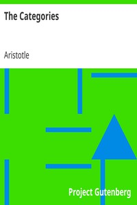

# The Categories <kbd>2412</kbd>

## Authors

 - Aristotle <small>(-384 - -322)</small>

## Subjects

 - Categories (Philosophy)
 - Logic -- Early works to 1800
 - Philosophy, Ancient

## Download

 - https://www.gutenberg.org/files/2412/2412.txt
 - https://www.gutenberg.org/files/2412/2412-h.zip
 - https://www.gutenberg.org/cache/epub/2412/pg2412.cover.small.jpg
 - https://www.gutenberg.org/ebooks/2412.html.images
 - https://www.gutenberg.org/ebooks/2412.kindle.images
 - https://www.gutenberg.org/ebooks/2412.txt.utf-8
 - https://www.gutenberg.org/ebooks/2412.rdf
 - https://www.gutenberg.org/ebooks/2412.epub.images

## Book Shelves

 - Classical Antiquity
 - Philosophy
