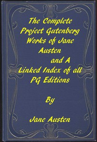

# The Complete Project Gutenberg Works of Jane Austen: A Linked Index of all PG Editions of Jane Austen <kbd>31100</kbd>

## Authors

 - Austen, Jane <small>(1775 - 1817)</small>

## Subjects

 - England -- Social life and customs -- Fiction
 - Love stories, English

## Download

 - https://www.gutenberg.org/files/31100/31100.zip
 - https://www.gutenberg.org/files/31100/instructions.txt
 - https://www.gutenberg.org/cache/epub/31100/pg31100.cover.small.jpg
 - https://www.gutenberg.org/ebooks/31100.html.images
 - https://www.gutenberg.org/ebooks/31100.txt.utf-8
 - https://www.gutenberg.org/ebooks/31100.epub.images
 - https://www.gutenberg.org/ebooks/31100.kindle.images
 - https://www.gutenberg.org/ebooks/31100.rdf
 - https://www.gutenberg.org/files/31100/31100-h/31100-h.htm

## Book Shelves

