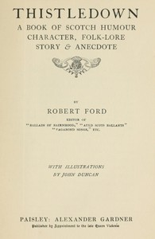

# Thistledown: A Book of Scotch Humour, Character, Folk-lore, Story & Anecdote <kbd>67576</kbd>

## Authors

 - Ford, Robert <small>(1846 - 1905)</small>

## Subjects

 - National characteristics, Scottish
 - Scotland -- Social life and customs
 - Scottish wit and humor

## Download

 - https://www.gutenberg.org/ebooks/67576.rdf
 - https://www.gutenberg.org/ebooks/67576.kindle.images
 - https://www.gutenberg.org/ebooks/67576.txt.utf-8
 - https://www.gutenberg.org/cache/epub/67576/pg67576.cover.small.jpg
 - https://www.gutenberg.org/files/67576/67576-h.zip
 - https://www.gutenberg.org/ebooks/67576.epub.images
 - https://www.gutenberg.org/files/67576/67576-0.txt
 - https://www.gutenberg.org/files/67576/67576-h/67576-h.htm

## Book Shelves

