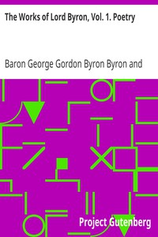

# The Works of Lord Byron, Vol. 1. Poetry <kbd>8861</kbd>

## Authors

 - Byron, George Gordon Byron, Baron <small>(1788 - 1824)</small>

## Subjects

 - Poetry

## Download

 - https://www.gutenberg.org/cache/epub/8861/pg8861.cover.medium.jpg
 - https://www.gutenberg.org/files/8861/8861-h.zip
 - https://www.gutenberg.org/files/8861/8861-8.txt
 - https://www.gutenberg.org/ebooks/8861.html.images
 - https://www.gutenberg.org/files/8861/8861-h/8861-h.htm
 - https://www.gutenberg.org/ebooks/8861.rdf
 - https://www.gutenberg.org/ebooks/8861.kindle.images
 - https://www.gutenberg.org/ebooks/8861.epub.images
 - https://www.gutenberg.org/ebooks/8861.txt.utf-8

## Book Shelves

